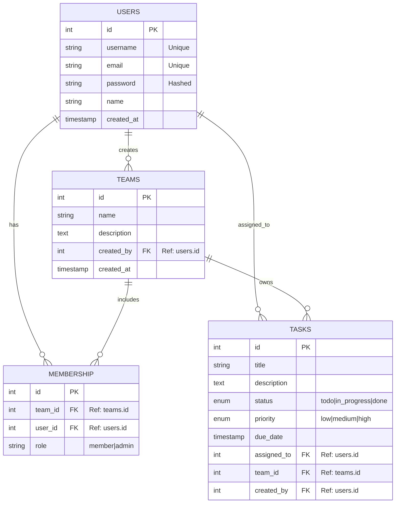
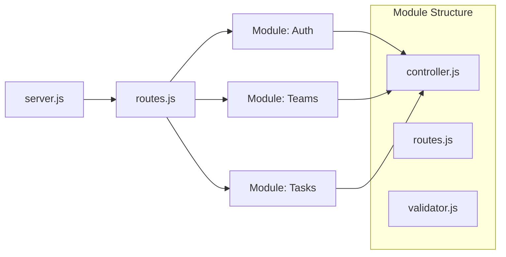
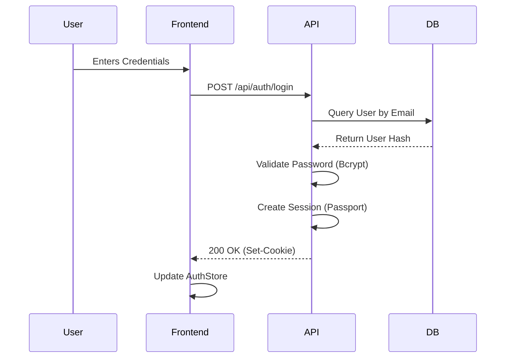
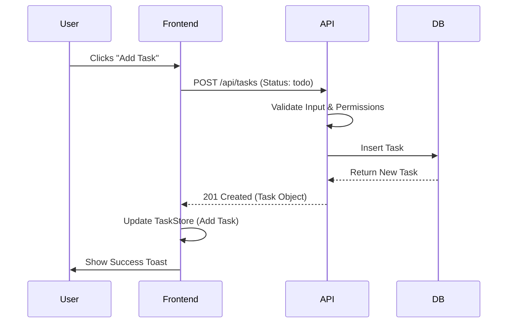

# NeonSprintMate Project Details

## 1. Executive Summary

**NeonSprintMate** is a full-stack task management application designed for modern teams. It leverages a PERN stack (PostgreSQL, Express, React, Node.js) to provide a robust, secure, and visually appealing platform for collaboration. The application features real-time updates, role-based access control (RBAC), and a distinctive "neon" aesthetic.

## 2. System Architecture

The system follows a layered architecture pattern, ensuring separation of concerns and scalability.

```mermaid
graph TD
    Client[Client Layer\n(React 19 + Vite)]
    Gateway[API Gateway Layer\n(Express + Passport)]
    Logic[Business Logic Layer\n(Controllers)]
    Data[Data Layer\n(Knex + PostgreSQL)]

    Client <-->|HTTPS/JSON| Gateway
    Gateway <--> Logic
    Logic <-->|SQL Queries| Data

    subgraph "Frontend (Client)"
        Stores[Zustand Stores]
        Router[React Router]
        Components[UI Components]
        Stores --> Components
        Router --> Components
    end

    subgraph "Backend (Server)"
        Auth[Auth Module]
        Teams[Teams Module]
        Tasks[Tasks Module]
        Middleware[Middleware\n(Auth, Validation)]
    end

    Gateway --> Middleware
    Middleware --> Auth
    Middleware --> Teams
    Middleware --> Tasks
```

### Key Components:
-   **Client Layer**: Built with React 19, utilizing Vite for fast builds. It uses Zustand for global state management (auth, teams, tasks) and generic components for the UI.
-   **API Gateway**: Express.js server handling routing, rate limiting (Arcjet), and security headers (Helmet).
-   **Business Logic**: Modularized controllers (Auth, Teams, Tasks) containing the core domain rules.
-   **Data Layer**: PostgreSQL database interacted with via Knex.js query builder.

## 3. Database Schema

The database is normalized and features foreign key constraints to maintain data integrity.



### Table Details:
1.  **Users**: Central entity. Stores credentials securely.
2.  **Teams**: Groups users together. `created_by` tracks the team owner.
3.  **Membership**: Junction table linking Users and Teams with a specific `role` (Admin/Member).
4.  **Tasks**: Work items. Linked to a specific Team and optionally assigned to a User. Includes status, priority, and due dates.

## 4. Module & File Structure

The codebase is organized by feature (vertical slice architecture) rather than just technical layers.

### Backend (`/backend`)


-   **Modules**: Each module (`auth`, `teams`, `tasks`) is self-contained with its own:
    -   `routes.js`: Route definitions.
    -   `controller.js`: Request handlers.
    -   `validator.js`: Input validation schemas (Express-Validator).

### Frontend (`/frontend`)
The frontend mimics the backend's feature structure.

-   **`src/features/`**: Contains `auth`, `teams`, `tasks`, `dashboard`.
    -   Each feature folder contains components specific to that domain (e.g., `LoginForm`, `TaskList`).
-   **`src/stores/`**: Global state using Zustand.
    -   `useAuthStore.js`: User session, login/logout actions.
    -   `useTeamStore.js`: Active team, team lists.
    -   `useTaskStore.js`: Task operations (CRUD).
-   **`src/components/`**: Shared "dumb" components (Buttons, Inputs, Modals).

## 5. API Endpoints Flow

### Authentication Flow


### Task Creation Flow


## 6. Security & Best Practices

-   **Authentication**: Session-based auth using Passport.js with secure, HTTP-only cookies.
-   **Validation**: All inputs validated using `express-validator` to prevent injection and bad data.
-   **Authorization**: Middleware checks for authentication (`isAuthenticated`) and specific roles (e.g., Team Admin) for sensitive actions.
-   **Performance**: Indexes on frequently queried columns (`team_id`, `assigned_to`).
-   **Environment**: Secrets managed via `.env` files, never committed to version control.

## 7. Configuration

-   **Backend**: `package.json` scripts (`dev`, `start`), `docker-compose.yaml` for containerization.
-   **Frontend**: `vite.config.js` for build settings, `tailwind.config.js` (implicit in v4)/CSS for styling.
